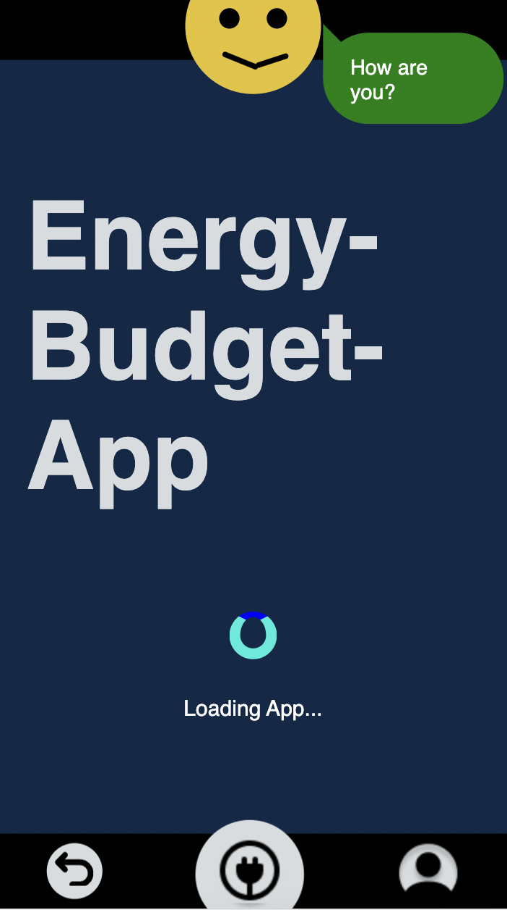

# Energy-Budget-App

The "Energy-Budget-App":  
A tool to consciously and sustainably save energy with smiling joy.

---

With this app you can track and budget your energy consumption for three categories. Different analytics and a feedback-system help to gain a quick overview and insight into your own consumption behavior.

---

## Tech-Stack

- Tech-Stack-Support
  - [Storybook](https://storybook.js.org/)
  - [Jest](https://jestjs.io/)
  - [Stylelint](https://stylelint.io/)
  - [Eslint](https://eslint.org/)
  - [Prettier](https://prettier.io/)
- TechStack-InAction:
  - react
  - react router
  - js / html / css & styled components
  - chartjs
  - animation with keyframe
  - figma
  - storybook
  - react testing library

---

## Preview

